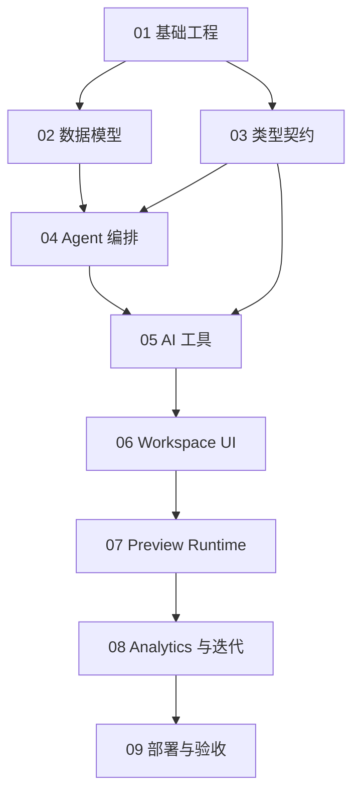

# VentureFlow MVP 开发任务拆分

本目录根据 `VentureFlow MVP 产品需求文档.docx` 和 `docs/technical-architecture.md` 拆分开发任务。计划按模块组织，每个模块都可以独立评审和执行，但建议按编号顺序推进。

## 执行顺序

1. [基础工程与开发规范](01-foundation.md)
2. [数据模型与持久化](02-data-model.md)
3. [类型契约与 Schema](03-contracts-and-schemas.md)
4. [Agent 编排与运行循环](04-agent-orchestration.md)
5. [AI 工具与应用生成](05-ai-tools-and-generation.md)
6. [Workspace UI 与项目工作台](06-workspace-ui.md)
7. [Sandpack Preview 与公开预览](07-preview-runtime.md)
8. [Usage Analytics 与自动迭代](08-analytics-growth-iteration.md)
9. [部署、可观测性与 Demo 验收](09-deploy-observability-demo.md)

## 模块依赖

## 统一约定

- 开发语言使用 TypeScript。
- 主应用使用 Next.js App Router。
- 数据访问使用 Prisma + Supabase PostgreSQL。
- AI 调用使用 Vercel AI SDK，统一封装模型、结构化输出和流式响应。
- Schema 校验使用 Zod。
- Agent 编排采用 `Mastra Agent/Tool + Autonomous Supervisor Agent + constrained tools + deterministic guardrails`。
- Mastra 负责 Agent、Tool、工具描述、工具输入输出 Schema 和本地调试；VentureFlow Runtime 负责最大步数、修复次数、状态持久化和 `finish_task` 完成校验。
- 生成应用只在 Sandpack 中运行，不执行任意后端代码。
- 每个模块完成后都需要运行对应测试，并提交一个聚焦 commit。

## P0 完成定义

- 用户可以创建项目并输入业务问题。
- 系统可以生成 Strategy、Product Blueprint、React 应用文件和 Review 结果。
- Workspace 可以展示 Timeline、Strategy、Blueprint、Preview、Analytics 和 Build Inspector。
- 生成应用可以在 Sandpack 中运行，并支持真实 CRUD 交互和 localStorage 持久化。
- 公开 Preview 可以访问并记录 Usage Events。
- Growth Agent 可以基于事件生成优化建议。
- Apply Improvement 可以生成新版本并保留旧版本。
