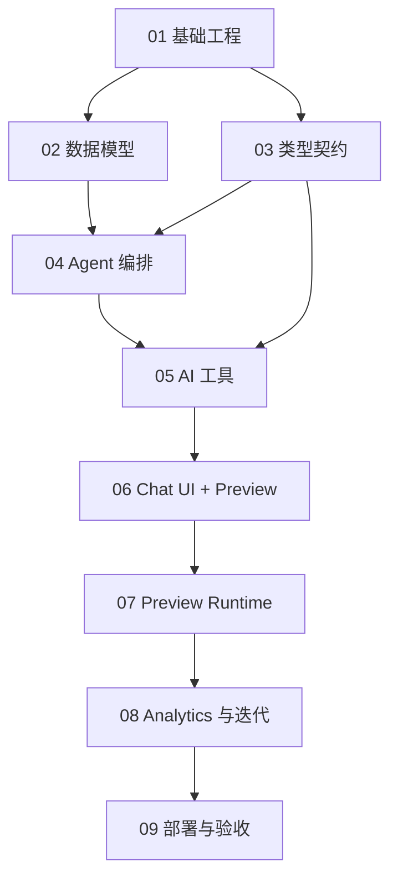

# VentureFlow MVP 开发任务拆分

本目录根据 `VentureFlow MVP 产品需求文档.docx` 和 `docs/technical-architecture.md` 拆分开发任务。计划按模块组织，每个模块都可以独立评审和执行，但建议按编号顺序推进。

VentureFlow MVP 采用 **"自主 Agent 管道 + 对话式干预"** 的混合交互模型：
- Agent 默认自主跑完 Strategy → Blueprint → Build 管道。
- 用户可以在任何阶段通过聊天消息介入——修改 Blueprint、重新生成、跳过或确认。
- 前端为 Chat + Preview 双栏布局，类似 lovable / atoms 的对话式 AI Builder。

## 执行顺序

1. [基础工程与开发规范](01-foundation.md)
2. [数据模型与持久化](02-data-model.md)
3. [类型契约与 Schema](03-contracts-and-schemas.md)
4. [Agent 编排与对话式运行循环](04-agent-orchestration.md)
5. [AI 工具与应用生成（含增量修改工具）](05-ai-tools-and-generation.md)
6. [Chat UI + Preview 双栏界面](06-workspace-ui.md)
7. [Sandpack Preview 与公开预览](07-preview-runtime.md)
8. [Usage Analytics 与自动迭代](08-analytics-growth-iteration.md)
9. [部署、可观测性与 Demo 验收](09-deploy-observability-demo.md)

## 模块依赖

## 统一约定

- 开发语言使用 TypeScript。
- 主应用使用 Next.js App Router。
- 数据访问使用 Prisma + Supabase PostgreSQL。
- AI 调用使用 Vercel AI SDK，统一封装模型、结构化输出和流式响应。
- Schema 校验使用 Zod。
- Agent 编排采用 **"自主管道 + 对话干预"混合模式**：`Mastra Agent/Tool + Supervisor Agent + constrained tools + deterministic guardrails + user intervention`。
- Mastra 负责 Agent、Tool、工具描述、工具输入输出 Schema 和本地调试；VentureFlow Runtime 负责最大步数、修复次数、对话中断/恢复、状态持久化和 `finish_task` 完成校验。
- 前端为 Chat + Preview 双栏布局，Chat Panel 通过 Message API 与服务端 Agent 通信。
- 生成应用只在 Sandpack 中运行，不执行任意后端代码。
- 每个模块完成后都需要运行对应测试，并提交一个聚焦 commit。

## P0 完成定义

- 用户在一页上通过对话创建项目并描述业务问题。
- Agent 自主执行 Strategy → Blueprint → Build 管道，每一步产出实时渲染在 Chat 中。
- 用户在任意阶段可以通过聊天消息干预——修改 Blueprint、重新生成、确认完成。
- Chat + Preview 双栏布局：左侧对话流，右侧 Sandpack 实时预览生成应用。
- 生成应用在 Sandpack 中运行，支持 CRUD 交互和 localStorage 持久化。
- 公开 Preview 可访问并记录 Usage Events。
- Growth Agent 可基于事件生成优化建议。
- Apply Improvement 可生成新版本并保留旧版本。
