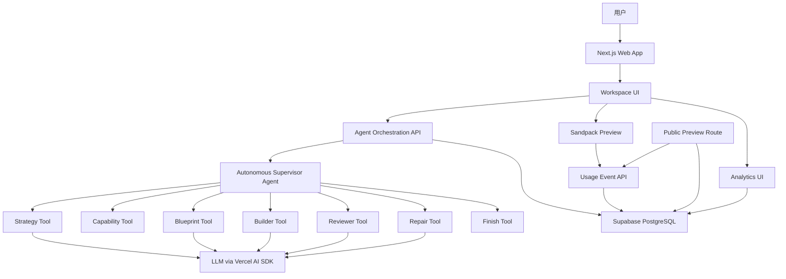
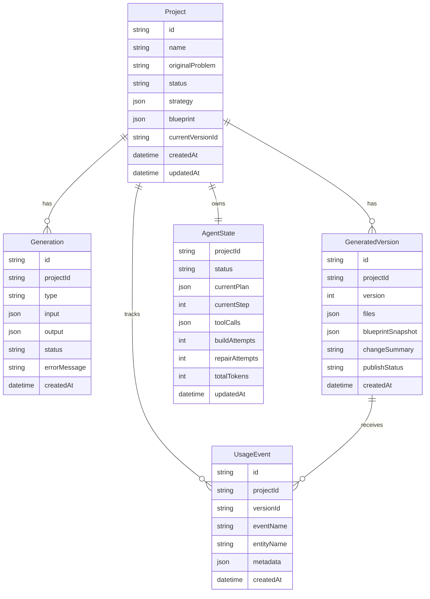
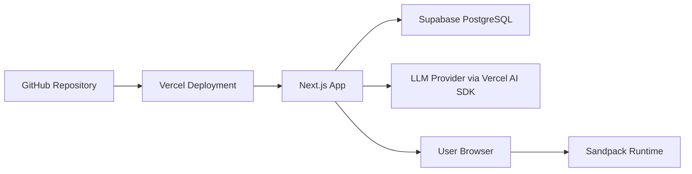

# VentureFlow MVP 技术选型及技术架构方案

## 1. 方案目标

VentureFlow MVP 的核心目标是验证一条完整的 Problem-to-Solution 闭环：

```text
业务问题输入
  -> Agent 分析问题
  -> 生成 Product Blueprint
  -> 生成可运行 React 应用
  -> Sandpack 在线预览和使用
  -> 采集 Usage Events
  -> AI 生成优化建议
  -> 生成改进版本
```

技术方案优先服务以下目标：

- 保证 AI 输出结构化、可校验、可恢复。
- 限制生成应用的运行边界，避免任意代码执行、任意依赖安装和无限 Agent 循环。
- 让产品看起来不是 Prompt-to-Code，而是 Problem-to-Solution。
- 为后续托管数据库、认证、独立部署和 Workflow Builder 留出扩展空间。

## 2. 技术选型总览

| 层级        | 技术选型                        | 用途                                                | 选择理由                                                    |
| ----------- | ------------------------------- | --------------------------------------------------- | ----------------------------------------------------------- |
| Web 框架    | Next.js App Router              | 主应用、API Routes、公开 Preview 路由               | 前后端一体，适合快速构建 AI Builder 和部署到 Vercel         |
| 开发语言    | TypeScript                      | 前端、服务端、Schema 类型                           | 与 Zod、React、Prisma 形成统一类型链路                      |
| UI          | React、Tailwind CSS、shadcn/ui  | 工作区、Timeline、Inspector、表单和业务 UI          | 组件成熟，能快速搭建专业工具型界面                          |
| 图标        | lucide-react                    | 按钮、状态、工具栏图标                              | 与 shadcn/ui 风格一致，轻量易用                             |
| 图表        | Recharts                        | Analytics、Dashboard、生成应用内图表                | 满足 MVP 数据看板能力，API 简单                             |
| AI 调用     | Vercel AI SDK                   | LLM 调用、结构化输出、流式状态                      | 与 Next.js 集成自然，适合服务端封装模型调用                 |
| Agent 编排  | Mastra + 自定义 Supervisor Loop | 有边界自治 Agent、工具调用、状态推进                | Mastra 提供 Agent/Tool 抽象，自定义 Loop 控制步数和终止条件 |
| Schema 校验 | Zod                             | Strategy、Blueprint、AgentAction、ReviewResult 校验 | 运行时校验明确，能直接推导 TypeScript 类型                  |
| 代码预览    | Sandpack                        | 浏览器内运行生成的 React 应用                       | 不需要动态容器，适合 MVP 安全边界                           |
| 数据库      | Supabase PostgreSQL             | 项目、生成版本、Agent 状态、Usage Events            | 托管成本低，适合快速上线和后续扩展                          |
| ORM         | Prisma                          | 数据模型、迁移、类型化查询                          | 提升数据访问一致性，方便维护项目状态                        |
| 应用内数据  | localStorage                    | 生成应用的业务数据持久化                            | MVP 避免动态数据库 Schema，降低复杂度                       |
| 部署        | Vercel                          | 主应用和公开 Preview                                | 与 Next.js 配套，部署路径短                                 |

## 3. 架构原则

### 3.1 Problem-first

系统不要求用户先定义应用功能，而是从业务问题出发，由 Agent 生成 Strategy 和 Product Blueprint，再生成应用。

### 3.2 路径自治，结果受控

Agent 可以自主决定工具调用顺序，但系统必须控制：

- 工具白名单。
- 最大执行步数。
- 最大生成和修复次数。
- 输出 Schema。
- 应用能力边界。
- 任务完成条件。

### 3.3 浏览器内运行，不执行任意后端代码

生成应用在 Sandpack 中运行，MVP 不为每个生成应用创建独立容器、后端服务或动态数据库。

### 3.4 中间产物可恢复

Strategy、Blueprint、Build、Review、AgentState、GeneratedVersion 都必须持久化。页面刷新或模型调用失败后，用户仍可以恢复项目状态。

### 3.5 数据驱动迭代

公开 Preview 中的操作必须记录 Usage Events。Growth Agent 只能基于真实事件或明确标识的 Demo data 生成优化建议。

## 4. 系统总体架构



系统分为五层：

- Presentation Layer：Next.js 页面、Workspace、Agent Timeline、Build Inspector、Analytics。
- Orchestration Layer：Supervisor Agent、工具白名单、运行循环、预算控制、完成条件校验。
- Generation Layer：Strategy、Blueprint、Build、Review、Repair 等 AI 工具。
- Runtime Layer：Sandpack 预览、公开 Preview 路由、生成应用数据 localStorage。
- Persistence Layer：Supabase PostgreSQL + Prisma，保存项目、版本、事件和 Agent 状态。

## 5. 前端架构

### 5.1 页面结构

```text
app/
  page.tsx
  projects/page.tsx
  projects/[projectId]/page.tsx
  preview/[projectId]/[versionId]/page.tsx
  api/
```

### 5.2 Workspace 布局

Workspace 采用三栏结构：

- 左侧：Agent Timeline，展示动态计划、工具调用、状态、错误和重试入口。
- 中间：主工作区，包含 Strategy、Blueprint、Preview、Analytics Tabs。
- 右侧：Build Inspector，展示文件树、代码、编译错误、当前版本和生成摘要。

### 5.3 核心前端模块

```text
components/
  workspace/
    AgentTimeline.tsx
    StrategyPanel.tsx
    BlueprintPanel.tsx
    PreviewPanel.tsx
    AnalyticsPanel.tsx
    BuildInspector.tsx
    VersionPanel.tsx
  generated-preview/
    SandpackRunner.tsx
    PublicPreviewShell.tsx
  ui/
    shadcn components
```

### 5.4 状态管理

MVP 优先使用 React Server Components + URL state + 局部 client state。复杂全局状态暂不引入 Redux 或 Zustand。

建议状态边界：

- 服务端状态：Project、Generation、GeneratedVersion、AgentState、UsageEvent，从 API 或 Server Action 获取。
- 客户端状态：当前 Tab、展开的 Timeline 节点、Sandpack 编译状态、Inspector 当前文件。
- 生成应用内部状态：由生成代码使用 localStorage 管理，不直接污染 Builder 主应用状态。

## 6. Agent 编排架构

### 6.1 编排模型

MVP 使用 Autonomous Supervisor Agent。专业 Agent 在实现上作为受控工具暴露：

```text
Supervisor Agent
  -> analyze_problem
  -> inspect_capabilities
  -> create_blueprint
  -> validate_blueprint
  -> generate_application
  -> inspect_build
  -> run_preview
  -> repair_application
  -> optimize_product
  -> save_project
  -> finish_task
```

这种设计保留多 Agent 的产品表达，同时避免每个 Agent 维护独立长会话带来的复杂度。

### 6.2 运行循环

```ts
const MAX_AGENT_STEPS = 12;
const MAX_BUILD_ATTEMPTS = 2;
const MAX_REPAIR_ATTEMPTS = 1;

async function runAgent(state: AgentState): Promise<AgentState> {
  for (let step = 0; step < MAX_AGENT_STEPS; step++) {
    const decision = await decideNextAction(state);

    if (decision.type === "finish") {
      if (canFinish(state)) {
        return markCompleted(state);
      }

      state = appendObservation(
        state,
        "Required outputs are missing or invalid.",
      );
      continue;
    }

    const result = await executeAllowedTool(
      decision.toolName,
      decision.arguments,
      state,
    );
    state = applyToolResult(state, decision, result);
    await saveAgentState(state);
  }

  return canFinish(state) ? markCompleted(state) : markFailed(state);
}
```

### 6.3 Action Schema

```ts
const agentActionSchema = z.discriminatedUnion("type", [
  z.object({
    type: z.literal("tool"),
    reasoningSummary: z.string(),
    toolName: toolNameSchema,
    arguments: z.record(z.unknown()),
  }),
  z.object({
    type: z.literal("finish"),
    reasoningSummary: z.string(),
  }),
]);
```

`reasoningSummary` 只保存简短决策摘要，不保存模型私有推理链。

### 6.4 完成条件

```ts
function canFinish(state: AgentState): boolean {
  return Boolean(
    state.strategy &&
    state.blueprint &&
    state.build?.files.length &&
    state.review?.passed,
  );
}
```

`finish_task` 还需要执行硬性校验：

- Strategy 存在，且 Facts 与 Assumptions 分离。
- Blueprint 通过 Zod 校验。
- Blueprint 未超出 MVP 应用类型和能力边界。
- Build 包含 `/App.tsx`。
- 文件未使用禁用依赖。
- Sandpack 基础编译通过。
- 至少实现新增、修改或状态变更、搜索/筛选/排序中的必要交互。
- 使用 localStorage 保存生成应用业务数据。

## 7. 数据架构

### 7.1 主要实体



### 7.2 Prisma 模型

```prisma
model Project {
  id               String             @id @default(cuid())
  name             String
  originalProblem  String
  status           ProjectStatus
  strategy         Json?
  blueprint        Json?
  currentVersionId String?
  createdAt        DateTime           @default(now())
  updatedAt        DateTime           @updatedAt

  generations      Generation[]
  versions         GeneratedVersion[]
  usageEvents      UsageEvent[]
  agentState       AgentState?
}

model Generation {
  id           String           @id @default(cuid())
  projectId    String
  type         GenerationType
  input        Json
  output       Json?
  status       GenerationStatus
  errorMessage String?
  createdAt    DateTime         @default(now())

  project      Project          @relation(fields: [projectId], references: [id])
}

model GeneratedVersion {
  id                String        @id @default(cuid())
  projectId         String
  version           Int
  files             Json
  blueprintSnapshot Json
  changeSummary     String
  publishStatus     PublishStatus @default(DRAFT)
  createdAt         DateTime      @default(now())

  project           Project       @relation(fields: [projectId], references: [id])
  usageEvents       UsageEvent[]
}

model AgentState {
  projectId      String   @id
  status         String
  currentPlan    Json
  currentStep    Int      @default(0)
  toolCalls      Json
  buildAttempts  Int      @default(0)
  repairAttempts Int      @default(0)
  totalTokens    Int      @default(0)
  updatedAt      DateTime @updatedAt

  project        Project  @relation(fields: [projectId], references: [id])
}

model UsageEvent {
  id         String   @id @default(cuid())
  projectId  String
  versionId  String
  eventName  String
  entityName String?
  metadata   Json?
  createdAt  DateTime @default(now())

  project    Project          @relation(fields: [projectId], references: [id])
  version    GeneratedVersion @relation(fields: [versionId], references: [id])
}
```

## 8. API 架构

### 8.1 Agent 编排 API

| API                                    | 方法   | 说明                        |
| -------------------------------------- | ------ | --------------------------- |
| `/api/projects`                        | `POST` | 创建项目并保存原始业务问题  |
| `/api/projects/{id}`                   | `GET`  | 获取项目详情                |
| `/api/projects/{id}/agent/run`         | `POST` | 启动或继续 Supervisor 编排  |
| `/api/projects/{id}/agent/state`       | `GET`  | 获取 AgentState 和 Timeline |
| `/api/projects/{id}/agent/stop`        | `POST` | 停止 Agent 执行             |
| `/api/projects/{id}/analyze`           | `POST` | 单独重试 Strategy Tool      |
| `/api/projects/{id}/design`            | `POST` | 单独重试 Blueprint Tool     |
| `/api/projects/{id}/build`             | `POST` | 单独重试 Builder Tool       |
| `/api/projects/{id}/review`            | `POST` | 单独重试 Reviewer Tool      |
| `/api/projects/{id}/optimize`          | `POST` | 运行 Growth Agent           |
| `/api/projects/{id}/apply-improvement` | `POST` | 根据优化建议生成新版本      |

### 8.2 Preview 和事件 API

| API                                               | 方法   | 说明                 |
| ------------------------------------------------- | ------ | -------------------- |
| `/preview/{projectId}/{versionId}`                | `GET`  | 公开访问生成应用     |
| `/api/projects/{id}/versions`                     | `GET`  | 获取版本列表         |
| `/api/projects/{id}/versions/{versionId}/publish` | `POST` | 发布指定版本         |
| `/api/events`                                     | `POST` | 记录生成应用使用事件 |
| `/api/projects/{id}/analytics`                    | `GET`  | 获取聚合指标         |

### 8.3 API 设计约束

- 所有 AI 输出必须先经过 Zod 校验，再写入数据库。
- Agent 工具调用失败时，记录 `Generation.status = failed` 和 `errorMessage`。
- 单步重试不能覆盖历史成功版本，只能追加新的 Generation 或 GeneratedVersion。
- 公开 Preview 可以匿名访问，但只能写入受控 Usage Events。

## 9. 应用生成架构

### 9.1 生成文件边界

生成应用必须输出固定格式：

```ts
type BuildOutput = {
  summary: string;
  files: Array<{
    path: string;
    content: string;
  }>;
};
```

推荐文件结构：

```text
/App.tsx
/components/AppLayout.tsx
/components/Dashboard.tsx
/components/EntityTable.tsx
/components/EntityForm.tsx
/lib/storage.ts
/data/seed.ts
/styles.css
```

### 9.2 依赖白名单

允许：

- `react`
- `react-dom`
- `lucide-react`
- `recharts`
- 项目预置的 UI 组件或样式能力

禁止：

- 外部网络请求。
- 动态安装依赖。
- Node.js 服务端 API。
- 访问宿主页面 DOM。
- 任意脚本注入。

### 9.3 生成质量检查

Reviewer 和静态检查需要覆盖：

- 是否存在 `/App.tsx` 和默认导出。
- 是否包含 Blueprint 中的核心页面和实体。
- 是否实现新增操作。
- 是否实现修改或状态变更操作。
- 是否实现搜索、筛选或排序中的至少一种。
- 是否使用 localStorage 持久化。
- 是否存在明显空操作按钮。
- 是否使用禁止依赖。

## 10. Analytics 与自动迭代

### 10.1 Usage Events

MVP 采集以下事件：

- `app_opened`
- `entity_created`
- `entity_updated`
- `entity_deleted`
- `filter_used`
- `search_used`
- `status_changed`
- `primary_action_clicked`

### 10.2 Analytics 聚合

Analytics 页面至少展示：

- 总访问量。
- 活跃操作数。
- 新增记录数。
- 状态变更次数。
- 搜索和筛选使用次数。
- 最常用核心动作。

### 10.3 Growth Agent 输入输出

Growth Agent 输入：

- 原始业务问题。
- Success Metrics。
- Product Blueprint。
- 当前版本文件摘要。
- Usage Events。

Growth Agent 输出：

```ts
type OptimizationRecommendation = {
  title: string;
  description: string;
  priority: "high" | "medium" | "low";
  evidence: string[];
  inference: string;
  expectedImpact: string;
  targetComponents: string[];
};
```

数据不足时必须明确提示，不允许把推断描述为事实。

## 11. 部署架构



MVP 部署策略：

- 主应用部署到 Vercel。
- Supabase 作为托管 PostgreSQL。
- API Key 只保存在 Vercel Environment Variables。
- 生成应用不单独部署容器，通过 `/preview/{projectId}/{versionId}` 加载版本文件。
- 公开 Preview 读取已发布版本，事件写入 `/api/events`。

## 12. 安全与边界

### 12.1 AI 安全边界

- 用户输入长度和内容做基础校验。
- Prompt 中明确能力边界和禁止事项。
- 所有模型输出必须通过 Zod 校验。
- JSON 解析失败允许有限重试。
- 不保存模型私有推理链，只保存 `reasoningSummary`。

### 12.2 生成代码安全边界

- 生成应用只能在 Sandpack 中运行。
- 禁止外部网络请求。
- 禁止动态依赖安装。
- 禁止服务端代码生成和执行。
- 禁止访问宿主页面 DOM。
- 禁止覆盖 Builder 主应用 localStorage key。

### 12.3 数据安全边界

- API Key 只存在服务端。
- 公开 Preview 只暴露发布版本需要的数据。
- Usage Events metadata 做字段白名单或大小限制。
- P0 不实现复杂权限，P1/P2 再引入认证和团队权限。

## 13. 可观测性

MVP 至少记录：

- Agent 执行状态。
- Agent 每步工具调用耗时。
- AI 调用失败。
- JSON 解析失败。
- Blueprint 校验失败。
- Builder 编译失败。
- Repair 触发次数。
- 公开 Preview 访问次数。
- Usage Events 写入失败。

事件结构：

```ts
type SystemLog = {
  projectId?: string;
  generationId?: string;
  level: "info" | "warn" | "error";
  eventName: string;
  message: string;
  metadata?: Record<string, unknown>;
  createdAt: string;
};
```

MVP 可以先使用服务端日志 + 数据库关键状态字段；生产阶段再接入 Sentry、OpenTelemetry 或专门日志平台。

## 14. 测试策略

### 14.1 单元测试

重点覆盖：

- Zod Schema。
- Blueprint 能力边界校验。
- Agent `canFinish`。
- 工具白名单校验。
- Usage Event 聚合逻辑。

### 14.2 集成测试

重点覆盖：

- 创建项目后启动 Agent。
- AgentState 每步持久化。
- Blueprint 失败时不能进入 Build。
- Build 失败时最多 Repair 一次。
- `finish_task` 未通过校验时不能 completed。

### 14.3 端到端测试

Demo 主链路：

```text
输入销售管理问题
  -> 生成 Strategy
  -> 生成 CRM Blueprint
  -> 生成 React 应用
  -> Sandpack 预览可操作
  -> 创建或更新一条线索
  -> 记录 Usage Event
  -> 生成优化建议
  -> Apply Improvement 生成 Version 2
```

## 15. MVP 开发顺序

1. 搭建 Next.js、Tailwind CSS、shadcn/ui、Prisma、Supabase 基础工程。
2. 实现 Project、Generation、GeneratedVersion、AgentState、UsageEvent 数据模型。
3. 实现 Strategy 和 Blueprint 的 Zod Schema。
4. 实现单步 Agent API：analyze、design、build、review。
5. 实现 Supervisor Agent Loop 和工具白名单。
6. 实现 Workspace UI、Agent Timeline、Strategy、Blueprint。
7. 接入 Sandpack Preview 和 Build Inspector。
8. 实现 Usage Events 和 Analytics。
9. 实现 Growth Agent 和 Apply Improvement。
10. 完成公开 Preview、部署、README 和 Demo Prompt。

## 16. 技术取舍

### 16.1 为什么不做动态容器

动态容器会引入部署、隔离、冷启动、安全和成本问题，不适合 MVP。Sandpack 足以验证“生成可交互应用”的核心价值。

### 16.2 为什么不做动态数据库 Schema

生成应用数据先使用 localStorage，避免为每个 Blueprint 动态迁移数据库。MVP 关注业务问题到应用原型的闭环，不把重点放在生产级数据建模上。

### 16.3 为什么不做完全自治 Agent

完全自治容易产生不可预测路径、循环修复和调试困难。MVP 采用 Supervisor Agent + constrained tools + deterministic guardrails，让 Agent 有自治感，同时保证成功率。

### 16.4 为什么保留阶段 API

统一编排 API 负责主链路，阶段 API 支持失败重试和调试。这样既能展示自治 Agent，也能在 Demo 中快速恢复失败阶段。

## 17. 后续演进

### 阶段一：MVP

- Problem-to-Solution 主链路。
- 受控 Agent 编排。
- Sandpack 运行生成应用。
- Usage Events 和 AI 优化建议。
- 版本迭代。

### 阶段二：生产级应用生成

- 托管数据库。
- 用户认证。
- 动态数据模型。
- 独立部署。
- GitHub 同步。

### 阶段三：App + Agent + Workflow

- Agent Builder。
- Workflow Builder。
- 定时任务。
- 外部系统连接。
- 审批流。
- 自动执行任务。

### 阶段四：Business Solution OS

- 市场研究。
- 用户研究。
- 行业解决方案。
- 获客渠道。
- SEO 和广告。
- 增长实验。
- 自动优化。
