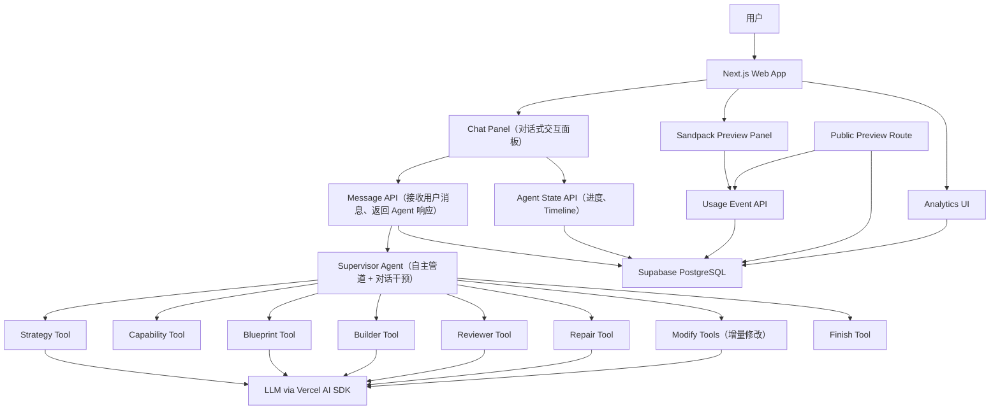
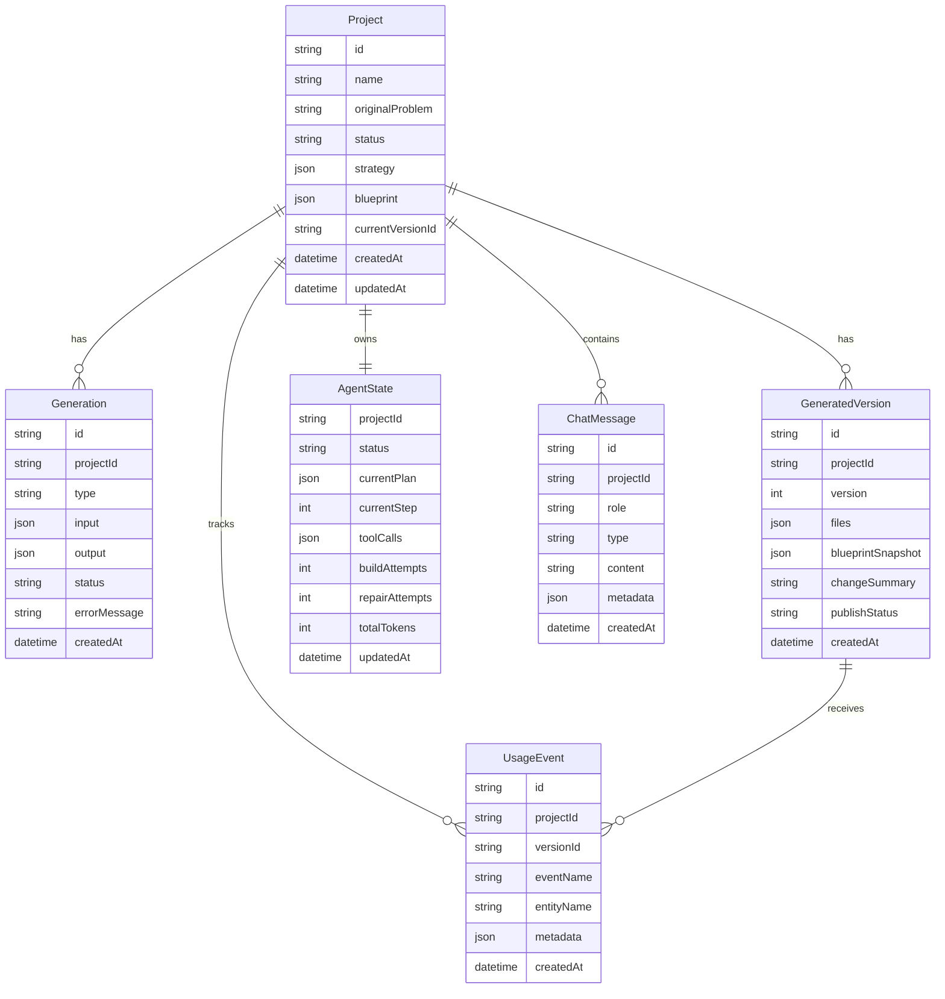
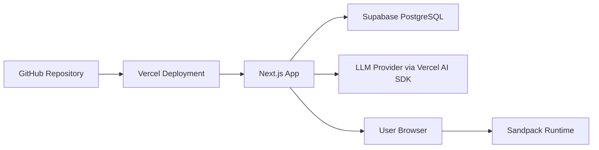

# VentureFlow MVP 技术选型及技术架构方案

## 1. 方案目标

VentureFlow MVP 的核心目标是验证一条完整的 Problem-to-Solution 闭环：

```text
用户描述业务问题（对话式输入）
  -> Agent 自主分析问题
  -> 生成 Product Blueprint
  -> 生成可运行 React 应用
  -> Sandpack 在线预览（右侧面板实时渲染）
  -> 用户可随时通过对话干预、修改或确认
  -> 采集 Usage Events
  -> AI 生成优化建议
  -> 生成改进版本
```

VentureFlow 采用 **"自主 Agent 管道 + 对话式干预"** 的混合交互模型：

- **默认行为**：Agent 自主跑完整条 Strategy → Blueprint → Build → Review 管道，用户无需干预。
- **对话干预**：用户可以在任何阶段通过聊天消息介入——修改 Blueprint、重新生成某部分、跳过步骤或确认完成。
- **实时反馈**：Agent 的每一步产出（Strategy 卡片、Blueprint 卡片、Sandpack Preview）实时渲染在聊天流中。右侧 Preview 面板始终可见，即时展示生成应用。

技术方案优先服务以下目标：

- 保证 AI 输出结构化、可校验、可恢复。
- 限制生成应用的运行边界，避免任意代码执行、任意依赖安装和无限 Agent 循环。
- 让产品体验像对话式 AI Builder（如 lovable、atoms），而非简单的 Prompt-to-Code。
- 为后续托管数据库、认证、独立部署和 Workflow Builder 留出扩展空间。

## 2. 技术选型总览

| 层级        | 技术选型                        | 用途                                                | 选择理由                                                    |
| ----------- | ------------------------------- | --------------------------------------------------- | ----------------------------------------------------------- |
| Web 框架    | Next.js App Router              | 主应用、API Routes、公开 Preview 路由               | 前后端一体，适合快速构建 AI Builder 和部署到 Vercel         |
| 开发语言    | TypeScript                      | 前端、服务端、Schema 类型                           | 与 Zod、React、Prisma 形成统一类型链路                      |
| UI          | React、Tailwind CSS、shadcn/ui  | 工作区、Timeline、Inspector、表单和业务 UI          | 组件成熟，能快速搭建专业工具型界面                          |
| 图标        | lucide-react                    | 按钮、状态、工具栏图标                              | 与 shadcn/ui 风格一致，轻量易用                             |
| 图表        | Recharts                        | Analytics、Dashboard、生成应用内图表                | 满足 MVP 数据看板能力，API 简单                             |
| AI 调用     | Vercel AI SDK                   | LLM 调用、结构化输出、流式响应、`useChat` hook    | 服务端模型调用 + 客户端对话状态管理一体化                   |
| Agent 编排  | Mastra + 自定义 Supervisor Loop | 有边界自治 Agent、工具调用、状态推进                | Mastra 提供 Agent/Tool 抽象，自定义 Loop 控制步数和终止条件 |
| Schema 校验 | Zod                             | Strategy、Blueprint、AgentAction、ReviewResult 校验 | 运行时校验明确，能直接推导 TypeScript 类型                  |
| 代码预览    | Sandpack                        | 浏览器内运行生成的 React 应用                       | 不需要动态容器，适合 MVP 安全边界                           |
| 数据库      | Supabase PostgreSQL             | 项目、生成版本、Agent 状态、Usage Events            | 托管成本低，适合快速上线和后续扩展                          |
| ORM         | Prisma                          | 数据模型、迁移、类型化查询                          | 提升数据访问一致性，方便维护项目状态                        |
| 应用内数据  | localStorage                    | 生成应用的业务数据持久化                            | MVP 避免动态数据库 Schema，降低复杂度                       |
| 部署        | Vercel                          | 主应用和公开 Preview                                | 与 Next.js 配套，部署路径短                                 |

## 3. 架构原则

### 3.1 Problem-first

系统不要求用户先定义应用功能，而是从业务问题出发，由 Agent 生成 Strategy 和 Product Blueprint，再生成应用。

### 3.2 路径自治 + 对话干预，结果受控

Agent 默认自主决定工具调用顺序和执行路径，用户可以随时通过对话消息干预。系统必须控制：

- 工具白名单。
- 最大执行步数。
- 最大生成和修复次数。
- 输出 Schema。
- 应用能力边界。
- 任务完成条件。

### 3.3 浏览器内运行，不执行任意后端代码

生成应用在 Sandpack 中运行，MVP 不为每个生成应用创建独立容器、后端服务或动态数据库。

### 3.4 中间产物可恢复

Strategy、Blueprint、Build、Review、AgentState、GeneratedVersion 都必须持久化。页面刷新或模型调用失败后，用户仍可以恢复项目状态。

### 3.5 数据驱动迭代

公开 Preview 中的操作必须记录 Usage Events。Growth Agent 只能基于真实事件或明确标识的 Demo data 生成优化建议。

## 4. 系统总体架构



系统分为五层：

- Presentation Layer：Next.js 页面、Chat Panel（对话交互）、Preview Panel（Sandpack 预览）、Analytics。
- Orchestration Layer：Supervisor Agent、工具白名单、自主运行循环、对话中断和恢复、消息路由、完成条件校验。
- Generation Layer：Strategy、Blueprint、Build、Review、Repair、增量修改等 AI 工具。
- Runtime Layer：Sandpack 预览、公开 Preview 路由、生成应用数据 localStorage。
- Persistence Layer：Supabase PostgreSQL + Prisma，保存项目、版本、事件、对话消息和 Agent 状态。

## 5. 前端架构

### 5.1 页面结构

```text
app/
  page.tsx                                                  # 首页（项目入口 + 初始消息输入）
  projects/[projectId]/page.tsx                             # 项目对话页（Chat + Preview 双栏）
  preview/[projectId]/[versionId]/page.tsx                  # 公开 Preview 页
  api/
    projects/route.ts                                       # 创建项目
    projects/[projectId]/agent/run/route.ts                 # 启动 Agent 自主管道
    projects/[projectId]/agent/messages/route.ts            # 对话消息 API（用户消息 → Agent 响应）
    projects/[projectId]/agent/state/route.ts               # Agent 状态（进度、Timeline）
    projects/[projectId]/agent/stop/route.ts                # 停止 Agent
    events/route.ts                                         # Usage Event 写入
```

### 5.2 项目页布局

项目页采用**双栏布局**——对话式 AI Builder 的标准交互模式：

```
┌──────────────────────────────┬─────────────────────────────────┐
│                              │                                 │
│     Chat Panel（对话面板）     │    Preview Panel（预览面板）      │
│     宽度：~420px              │    宽度：flex（剩余空间）          │
│                              │                                 │
│   ┌────────────────────────┐ │  ┌───────────────────────────┐  │
│   │ 🟡 Agent 正在分析业务.. │ │  │                           │  │
│   │                        │ │  │   Sandpack Preview        │  │
│   │ ┌────────────────────┐ │ │  │   生成的应用实时渲染       │  │
│   │ │ ✅ Strategy 完成    │ │ │  │                           │  │
│   │ │ 问题：销售线索分散   │ │ │  │   [仪表盘] [线索列表]     │  │
│   │ │ 推荐：CRM 应用      │ │ │  │   ┌─────────────────┐    │  │
│   │ └────────────────────┘ │ │  │   │                 │    │  │
│   │                        │ │  │   │   生成应用预览    │    │  │
│   │ ┌────────────────────┐ │ │  │   │                 │    │  │
│   │ │ 📋 Blueprint 完成   │ │ │  │   └─────────────────┘    │  │
│   │ │ 实体：Lead, Contact │ │ │  │                           │  │
│   │ │ 页面：2 个          │ │ │  └───────────────────────────┘  │
│   │ └────────────────────┘ │ │                                 │
│   │                        │ │                                 │
│   │ ┌────────────────────┐ │ │                                 │
│   │ │ 💬 用户输入区域     │ │ │                                 │
│   │ └────────────────────┘ │ │                                 │
│   └────────────────────────┘ │                                 │
│                              │                                 │
└──────────────────────────────┴─────────────────────────────────┘
```

**移动端（<768px）**：Chat 和 Preview 切换显示（Tab 或全屏切换），不支持并排。

### 5.3 核心前端模块

```text
components/
  chat/
    ChatPanel.tsx              # 对话面板容器（消息列表 + 输入框）
    ChatMessage.tsx            # 单条消息渲染（区分用户/AI/系统消息类型）
    ChatInput.tsx              # 消息输入框（支持 Shift+Enter 换行）
    AgentProgressBar.tsx       # Agent 步骤进度条（"3/6 步骤完成"）
    MessageCard.tsx            # 富交互消息卡片容器
    StrategyCard.tsx           # Strategy 分析结果卡片
    BlueprintCard.tsx          # Product Blueprint 卡片（可展开详情）
    BuildResultCard.tsx        # Builder 完成卡片（含 Preview 跳转）
    ReviewResultCard.tsx       # 审查结果卡片
    OptimizationCard.tsx       # 优化建议卡片
    InlineActions.tsx          # 每条 AI 消息的内联操作按钮（[修改] [重新生成] [确认]）
  generated-preview/
    SandpackRunner.tsx         # Sandpack Provider + Preview + CodeEditor
    PublicPreviewShell.tsx     # 公开 Preview 壳
  projects/
    CreateProjectForm.tsx      # 首页创建项目表单
    RecentProjects.tsx         # 最近项目列表
  ui/
    shadcn components           # 基础 UI 组件
```

### 5.4 消息类型

对话中的消息分为三类，每种在 UI 中渲染为不同的视觉形态：

| 消息类型 | 发送者 | 视觉表现 | 示例 |
|---------|--------|---------|------|
| `user-text` | 用户 | 右侧气泡，深色背景 | "做一个销售 CRM" |
| `agent-thinking` | Agent | 加载动画 + 步骤说明 | "正在分析业务问题..." |
| `agent-strategy` | Agent | Strategy 卡片（可展开） | 业务分析结论 |
| `agent-blueprint` | Agent | Blueprint 卡片（可查看/修改） | 实体定义、页面列表 |
| `agent-build` | Agent | 构建完成卡片 + Preview 高亮 | "应用已生成" |
| `agent-review` | Agent | 审查结果卡片 | "✅ 审查通过" |
| `agent-error` | Agent | 错误卡片（红色） | "Blueprint 校验失败" |
| `agent-question` | Agent | 提问卡片（等待用户回复） | "是否需要添加审批功能？" |
| `system-info` | 系统 | 灰色提示条 | "项目已创建" |

### 5.5 状态管理

对话式交互的状态管理策略：

- **聊天客户端状态**：使用 Vercel AI SDK 的 `useChat` hook 管理消息列表、流式 SSE 接收、输入框绑定、loading/error 状态。无需手写 fetch + useState。
- **服务端状态**：Project、AgentState，从 API 获取。
- **Preview 状态**：当前展示的版本文件、Sandpack 编译状态。从 `useChat.onFinish` 回调中的 `message.metadata` 提取 build 数据。
- **生成应用内部状态**：由生成代码使用 localStorage 管理，key 以 `vf-generated-` 开头。
- **消息类型扩展**：在 Vercel AI SDK 的 `Message` 类型基础上附加 `type` 和 `metadata` 字段，用于路由到 Strategy / Blueprint / Build 等富交互卡片。

## 6. Agent 编排架构

### 6.1 编排模型

MVP 采用 **"自主管道 + 对话干预"** 混合模式。Supervisor Agent 在 Mastra 框架上实现，专业 Agent 作为受控工具暴露：

```text
Supervisor Agent
  -> analyze_problem
  -> inspect_capabilities
  -> create_blueprint
  -> validate_blueprint
  -> generate_application
  -> inspect_build
  -> run_preview
  -> repair_application
  -> modify_blueprint       （用户触发：增量修改 Blueprint）
  -> regenerate_page        （用户触发：重新生成某页面）
  -> ask_user               （Agent 主动向用户提问）
  -> optimize_product
  -> save_project
  -> finish_task
```

**两种执行模式**：

1. **自主管道模式**（默认）：用户提交问题后，Agent 按 Strategy → Blueprint → Build 顺序自主执行。每个步骤完成后发送消息到聊天流，但不等待用户回复。

2. **对话干预模式**：用户在任何步骤中发送消息，Agent 根据消息内容决定下一步：
   - 继续管道（"可以，继续"）
   - 增量修改（"再加一个 Entity"）
   - 重新生成（"Blueprint 不对，重做"）
   - 跳过步骤（"直接生成应用"）
   - 确认完成（"就这样"）

### 6.2 Agent 状态机

```ts
type AgentStatus = 
  | "planning"          // 初始规划中
  | "executing"         // 正在执行工具
  | "waiting_for_user"  // 产出结果后等待用户反馈
  | "completed"         // 用户确认完成或管道自然结束
  | "failed"            // 执行失败
  | "stopped"           // 用户主动停止
```

状态流转：

```
planning → executing ⇄ waiting_for_user → completed
                ↘            ↗
                 failed    stopped
```

### 6.3 运行循环（对话式版本）

```ts
const MAX_AGENT_STEPS = 12;
const MAX_BUILD_ATTEMPTS = 2;
const MAX_REPAIR_ATTEMPTS = 1;

// 接收用户消息，返回 Agent 响应
async function handleUserMessage(
  projectId: string,
  userMessage: string,
): Promise<AgentResponse> {
  const state = await loadAgentState(projectId);

  // 如果用户在 Agent 等待时发送消息，处理干预指令
  if (state.status === "waiting_for_user") {
    return handleIntervention(state, userMessage);
  }

  // 如果 Agent 空闲，启动自主管道
  return runAgent(state);
}

// 处理用户干预指令
async function handleIntervention(
  state: AgentState,
  userMessage: string,
): Promise<AgentResponse> {
  const intent = await parseUserIntent(userMessage, state);

  switch (intent.type) {
    case "continue":
      return runAgent(state);  // 恢复自主管道
    case "modify":
      // 调用对应增量工具（modify_blueprint 等）
      return executeAllowedTool(intent.toolName, intent.arguments, state);
    case "skip_to_build":
      return fastForwardTo(state, "generate_application");
    case "accept":
      return finishTask(state);
    case "question":
      // 用户回答了 Agent 的提问
      return runAgent(appendUserAnswer(state, userMessage));
  }
}

// 自主管道（每次执行一步，发消息给聊天流，然后返回）
async function runStep(state: AgentState): Promise<AgentResponse> {
  if (state.currentStep >= MAX_AGENT_STEPS) {
    return finishOrFail(state);
  }

  const decision = await decideNextAction(state);

  if (decision.type === "finish") {
    if (canFinish(state)) {
      return finishTask(state);
    }
    return { state, message: "Required outputs missing.", status: "executing" };
  }

  // 执行工具调用
  const result = await executeAllowedTool(decision.toolName, decision.arguments, state);
  state = applyToolResult(state, decision, result);
  await saveAgentState(state);

  // 生成用户可见的消息卡片
  const message = buildAgentMessage(state, result);

  // 判断是否需要等待用户
  if (shouldWaitForUser(state)) {
    state.status = "waiting_for_user";
    return { state, message, status: "waiting_for_user" };
  }

  // 继续下一步
  return { state, message, status: "executing" };
}
```

### 6.4 用户意图解析

Agent 需要理解用户的自然语言干预指令，映射到具体工具调用：

| 用户消息示例 | 解析为意图 | 对应行动 |
|-------------|-----------|---------|
| "继续" / "go on" | `continue` | 恢复自主管道 |
| "再加一个 Contact 实体" | `modify` | → `modify_blueprint` |
| "仪表盘页面去掉" | `modify` | → `modify_blueprint` |
| "重新生成搜索功能" | `modify` | → `regenerate_page` |
| "可以了，就这样" | `accept` | → `finish_task` |
| "Blueprint 全部重做" | `redo_blueprint` | → `create_blueprint`（重置） |
| "直接生成看看" | `skip_to_build` | → 跳到 `generate_application` |

意图解析通过 LLM 调用 + 结构化输出实现，严格限制可选行动集合。

### 6.5 完成条件（对话式调整）

```ts
function canFinish(state: AgentState): boolean {
  // 管道自然完成条件不变
  const pipelineComplete = Boolean(
    state.strategy &&
    state.blueprint &&
    state.build?.files.length &&
    state.review?.passed,
  );

  // 对话式下，用户也可以主动确认完成（即使管道未完全跑完）
  return pipelineComplete || state.status === "waiting_for_user";
}
```

`finish_task` 硬性校验保持不变：
- Blueprint 通过 Zod 校验。
- Build 包含 `/App.tsx`。
- 文件未使用禁用依赖。
- 使用 localStorage 保存生成应用业务数据。

## 7. 数据架构

### 7.1 主要实体



### 7.2 Prisma 模型

```prisma
model Project {
  id               String             @id @default(cuid())
  name             String
  originalProblem  String
  status           ProjectStatus
  strategy         Json?
  blueprint        Json?
  currentVersionId String?
  createdAt        DateTime           @default(now())
  updatedAt        DateTime           @updatedAt

  generations      Generation[]
  versions         GeneratedVersion[]
  usageEvents      UsageEvent[]
  agentState       AgentState?
}

model Generation {
  id           String           @id @default(cuid())
  projectId    String
  type         GenerationType
  input        Json
  output       Json?
  status       GenerationStatus
  errorMessage String?
  createdAt    DateTime         @default(now())

  project      Project          @relation(fields: [projectId], references: [id])
}

model GeneratedVersion {
  id                String        @id @default(cuid())
  projectId         String
  version           Int
  files             Json
  blueprintSnapshot Json
  changeSummary     String
  publishStatus     PublishStatus @default(DRAFT)
  createdAt         DateTime      @default(now())

  project           Project       @relation(fields: [projectId], references: [id])
  usageEvents       UsageEvent[]
}

model AgentState {
  projectId      String   @id
  status         String
  currentPlan    Json
  currentStep    Int      @default(0)
  toolCalls      Json
  buildAttempts  Int      @default(0)
  repairAttempts Int      @default(0)
  totalTokens    Int      @default(0)
  updatedAt      DateTime @updatedAt

  project        Project  @relation(fields: [projectId], references: [id])
}

model UsageEvent {
  id         String   @id @default(cuid())
  projectId  String
  versionId  String
  eventName  String
  entityName String?
  metadata   Json?
  createdAt  DateTime @default(now())

  project    Project          @relation(fields: [projectId], references: [id])
  version    GeneratedVersion @relation(fields: [versionId], references: [id])
}

model ChatMessage {
  id        String   @id @default(cuid())
  projectId String
  role      String   // "user" | "agent" | "system"
  type      String   // "user-text" | "agent-strategy" | "agent-blueprint" | "agent-build" | "agent-review" | "agent-error" | "agent-question" | "system-info"
  content   String   // 展示文本（Markdown）
  metadata  Json?    // 结构化数据（Strategy/Blueprint/Build 等完整 JSON，用于卡片渲染）
  createdAt DateTime @default(now())

  project   Project  @relation(fields: [projectId], references: [id])
}
```

## 8. API 架构

### 8.1 Agent 编排与对话 API

| API                                               | 方法   | 说明                             |
| ------------------------------------------------- | ------ | -------------------------------- |
| `/api/projects`                                   | `POST` | 创建项目并保存原始业务问题         |
| `/api/projects/{id}`                              | `GET`  | 获取项目详情                      |
| `/api/projects/{id}/agent/messages`               | `POST` | **发送用户消息**，返回 Agent 响应   |
| `/api/projects/{id}/agent/messages`               | `GET`  | 获取对话消息历史                  |
| `/api/projects/{id}/agent/run`                    | `POST` | 启动或继续 Agent 自主管道（内部调用）|
| `/api/projects/{id}/agent/state`                  | `GET`  | 获取 AgentState 和进度信息         |
| `/api/projects/{id}/agent/stop`                   | `POST` | 停止 Agent 执行                   |
| `/api/projects/{id}/agent/stream`                 | `GET`  | SSE 流式推送 Agent 执行进度        |
| `/api/projects/{id}/optimize`                     | `POST` | 运行 Growth Agent                |
| `/api/projects/{id}/apply-improvement`            | `POST` | 根据优化建议生成新版本             |

### 8.2 Preview 和事件 API

| API                                               | 方法   | 说明                 |
| ------------------------------------------------- | ------ | -------------------- |
| `/preview/{projectId}/{versionId}`                | `GET`  | 公开访问生成应用     |
| `/api/projects/{id}/versions`                     | `GET`  | 获取版本列表         |
| `/api/projects/{id}/versions/{versionId}/publish` | `POST` | 发布指定版本         |
| `/api/events`                                     | `POST` | 记录生成应用使用事件 |
| `/api/projects/{id}/analytics`                    | `GET`  | 获取聚合指标         |

### 8.3 API 设计约束

- 所有 AI 输出必须先经过 Zod 校验，再写入数据库。
- Agent 工具调用失败时，记录 `Generation.status = failed` 和 `errorMessage`。
- 单步重试不能覆盖历史成功版本，只能追加新的 Generation 或 GeneratedVersion。
- 公开 Preview 可以匿名访问，但只能写入受控 Usage Events。

## 9. 应用生成架构

### 9.1 生成文件边界

生成应用必须输出固定格式：

```ts
type BuildOutput = {
  summary: string;
  files: Array<{
    path: string;
    content: string;
  }>;
};
```

推荐文件结构：

```text
/App.tsx
/components/AppLayout.tsx
/components/Dashboard.tsx
/components/EntityTable.tsx
/components/EntityForm.tsx
/lib/storage.ts
/data/seed.ts
/styles.css
```

### 9.2 依赖白名单

允许：

- `react`
- `react-dom`
- `lucide-react`
- `recharts`
- 项目预置的 UI 组件或样式能力

禁止：

- 外部网络请求。
- 动态安装依赖。
- Node.js 服务端 API。
- 访问宿主页面 DOM。
- 任意脚本注入。

### 9.3 生成质量检查

Reviewer 和静态检查需要覆盖：

- 是否存在 `/App.tsx` 和默认导出。
- 是否包含 Blueprint 中的核心页面和实体。
- 是否实现新增操作。
- 是否实现修改或状态变更操作。
- 是否实现搜索、筛选或排序中的至少一种。
- 是否使用 localStorage 持久化。
- 是否存在明显空操作按钮。
- 是否使用禁止依赖。

## 10. Analytics 与自动迭代

### 10.1 Usage Events

MVP 采集以下事件：

- `app_opened`
- `entity_created`
- `entity_updated`
- `entity_deleted`
- `filter_used`
- `search_used`
- `status_changed`
- `primary_action_clicked`

### 10.2 Analytics 聚合

Analytics 页面至少展示：

- 总访问量。
- 活跃操作数。
- 新增记录数。
- 状态变更次数。
- 搜索和筛选使用次数。
- 最常用核心动作。

### 10.3 Growth Agent 输入输出

Growth Agent 输入：

- 原始业务问题。
- Success Metrics。
- Product Blueprint。
- 当前版本文件摘要。
- Usage Events。

Growth Agent 输出：

```ts
type OptimizationRecommendation = {
  title: string;
  description: string;
  priority: "high" | "medium" | "low";
  evidence: string[];
  inference: string;
  expectedImpact: string;
  targetComponents: string[];
};
```

数据不足时必须明确提示，不允许把推断描述为事实。

## 11. 部署架构



MVP 部署策略：

- 主应用部署到 Vercel。
- Supabase 作为托管 PostgreSQL。
- API Key 只保存在 Vercel Environment Variables。
- 生成应用不单独部署容器，通过 `/preview/{projectId}/{versionId}` 加载版本文件。
- 公开 Preview 读取已发布版本，事件写入 `/api/events`。

## 12. 安全与边界

### 12.1 AI 安全边界

- 用户输入长度和内容做基础校验。
- Prompt 中明确能力边界和禁止事项。
- 所有模型输出必须通过 Zod 校验。
- JSON 解析失败允许有限重试。
- 不保存模型私有推理链，只保存 `reasoningSummary`。

### 12.2 生成代码安全边界

- 生成应用只能在 Sandpack 中运行。
- 禁止外部网络请求。
- 禁止动态依赖安装。
- 禁止服务端代码生成和执行。
- 禁止访问宿主页面 DOM。
- 禁止覆盖 Builder 主应用 localStorage key。

### 12.3 数据安全边界

- API Key 只存在服务端。
- 公开 Preview 只暴露发布版本需要的数据。
- Usage Events metadata 做字段白名单或大小限制。
- P0 不实现复杂权限，P1/P2 再引入认证和团队权限。

## 13. 可观测性

MVP 至少记录：

- Agent 执行状态。
- Agent 每步工具调用耗时。
- AI 调用失败。
- JSON 解析失败。
- Blueprint 校验失败。
- Builder 编译失败。
- Repair 触发次数。
- 公开 Preview 访问次数。
- Usage Events 写入失败。

事件结构：

```ts
type SystemLog = {
  projectId?: string;
  generationId?: string;
  level: "info" | "warn" | "error";
  eventName: string;
  message: string;
  metadata?: Record<string, unknown>;
  createdAt: string;
};
```

MVP 可以先使用服务端日志 + 数据库关键状态字段；生产阶段再接入 Sentry、OpenTelemetry 或专门日志平台。

## 14. 测试策略

### 14.1 单元测试

重点覆盖：

- Zod Schema。
- Blueprint 能力边界校验。
- Agent `canFinish`。
- 工具白名单校验。
- Usage Event 聚合逻辑。

### 14.2 集成测试

重点覆盖：

- 创建项目后启动 Agent。
- AgentState 每步持久化。
- Blueprint 失败时不能进入 Build。
- Build 失败时最多 Repair 一次。
- `finish_task` 未通过校验时不能 completed。

### 14.3 端到端测试

Demo 主链路：

```text
输入销售管理问题
  -> 生成 Strategy
  -> 生成 CRM Blueprint
  -> 生成 React 应用
  -> Sandpack 预览可操作
  -> 创建或更新一条线索
  -> 记录 Usage Event
  -> 生成优化建议
  -> Apply Improvement 生成 Version 2
```

## 15. MVP 开发顺序

1. 搭建 Next.js、Tailwind CSS、shadcn/ui、Prisma、Supabase 基础工程。
2. 实现 Project、Generation、GeneratedVersion、AgentState、UsageEvent、ChatMessage 数据模型。
3. 实现 Strategy 和 Blueprint 的 Zod Schema。
4. 实现 Agent 编排（自主管道 + 对话干预）。
5. 实现 AI 工具（Strategy、Blueprint、Build、Review、Repair、增量修改工具）。
6. 实现对话 API（消息发送、Agent 响应、SSE 流式推送）。
7. 实现 Chat + Preview 双栏前端 UI。
8. 接入 Sandpack Preview。
9. 实现 Usage Events 和 Analytics。
10. 实现 Growth Agent 和 Apply Improvement。
11. 完成公开 Preview、部署、README 和 Demo Prompt。

## 16. 技术取舍

### 16.1 为什么不做动态容器

动态容器会引入部署、隔离、冷启动、安全和成本问题，不适合 MVP。Sandpack 足以验证“生成可交互应用”的核心价值。

### 16.2 为什么不做动态数据库 Schema

生成应用数据先使用 localStorage，避免为每个 Blueprint 动态迁移数据库。MVP 关注业务问题到应用原型的闭环，不把重点放在生产级数据建模上。

### 16.3 为什么不做完全自治 Agent

完全自治容易产生不可预测路径、循环修复和调试困难。MVP 采用 Supervisor Agent + constrained tools + deterministic guardrails，让 Agent 有自治感，同时保证成功率。

### 16.4 为什么选择对话式交互

对话式 AI Builder 是当前最成熟的 AI 应用生成产品形态（lovable、atoms、Figma AI 等）。与纯三栏工作台相比：
- 降低了用户理解成本——对话是人人熟悉的交互范式。
- Agent 自主执行管道时用户无需干预，但随时可以精准干预。
- 右侧始终可见的 Preview 让用户即时验证生成结果。

### 16.5 为什么保留阶段 API 作为内部实现

对话 API（`/messages`）是面向用户的唯一入口。阶段 API 保留为内部实现，供 Agent 自主管道和增量修改调用。这样对外呈现简洁的对话式体验，对内保持工具链的可测试性和可调试性。

## 17. 后续演进

### 阶段一：MVP

- Problem-to-Solution 主链路。
- 受控 Agent 编排。
- Sandpack 运行生成应用。
- Usage Events 和 AI 优化建议。
- 版本迭代。

### 阶段二：生产级应用生成

- 托管数据库。
- 用户认证。
- 动态数据模型。
- 独立部署。
- GitHub 同步。

### 阶段三：App + Agent + Workflow

- Agent Builder。
- Workflow Builder。
- 定时任务。
- 外部系统连接。
- 审批流。
- 自动执行任务。

### 阶段四：Business Solution OS

- 市场研究。
- 用户研究。
- 行业解决方案。
- 获客渠道。
- SEO 和广告。
- 增长实验。
- 自动优化。
